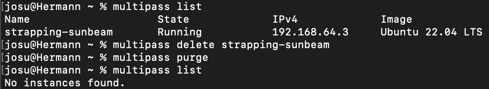

# KN01

## B) Multipass aufgesetzt
<br>
<br>

```bash
multipass list
```

<br>
<br>

```
UI von Multipass
```

<br>
<br>
<br>
<br>

## C) Commands für das modifying von Instanzen
<br>
<br>

```
Commands für das starten und stoppen von Instanzen
```

<br>
<br>


```
Änderung von CPUs von Instanzen
```

<br>
<br>

```
Shell einer Instanze
```


<br>
<br>

```
Instanze VERNICHTEN!!
```

<br>
<br>
<br>
<br>
## D) Ubuntu mit Webserver und Datenbank aufsetzen
<br>
<br>


