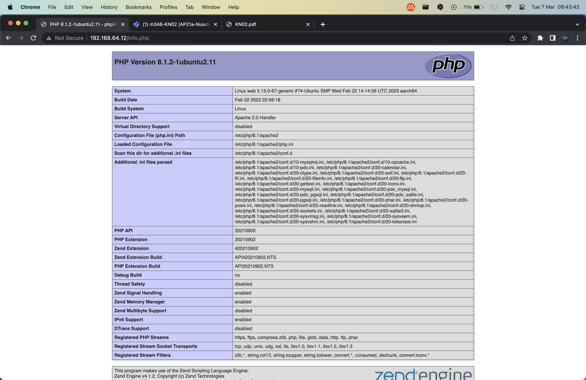
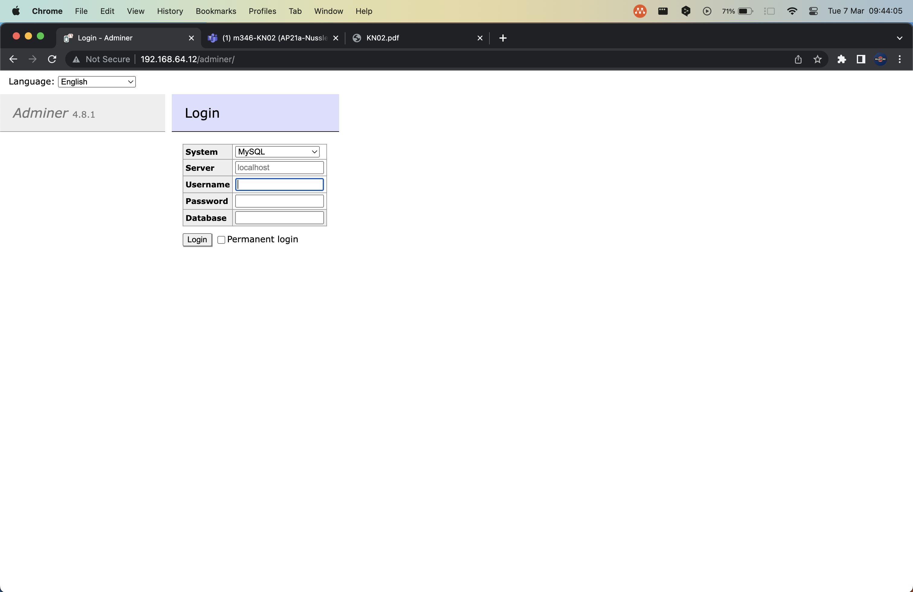

# KN02

## B) Apache Server aufstellen


## C) Cloud-init

```bash
Info
```

```bash
Adminer
```

```bash
db
```


Wieso funktioniert es nicht?

Es gibt eine sehr einfache erklärung. Für einen Datenaustausch müsen die Docker im gleichen Netzwerk sein, aber da sie iin zwei verschiedenen VMs sind, werden sie somit isoliert und das bringt dazu, dass sie sich nicht erreichen können.