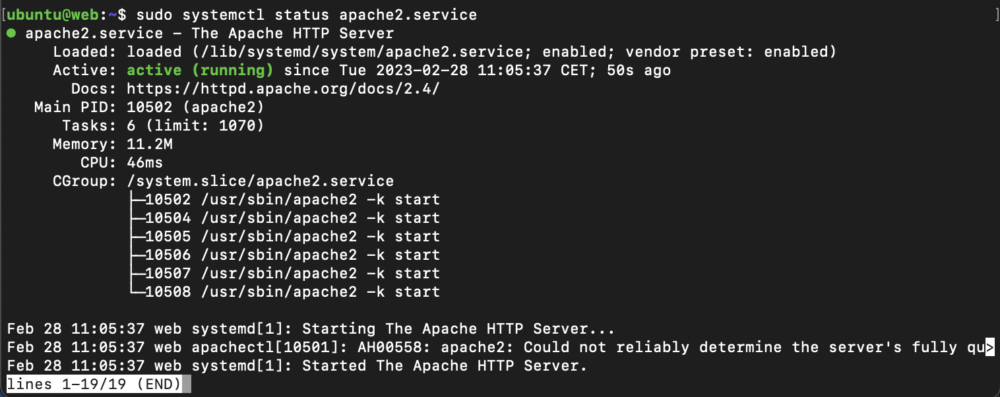
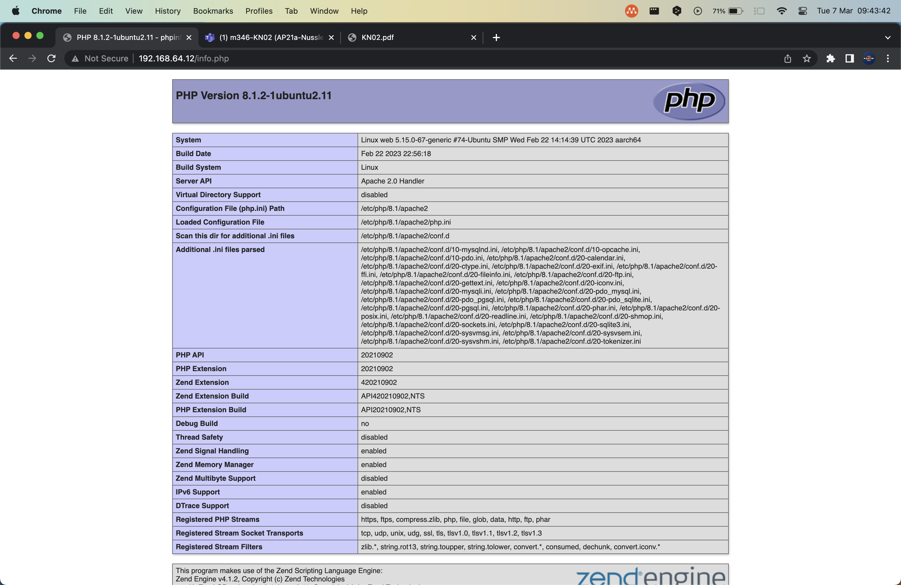
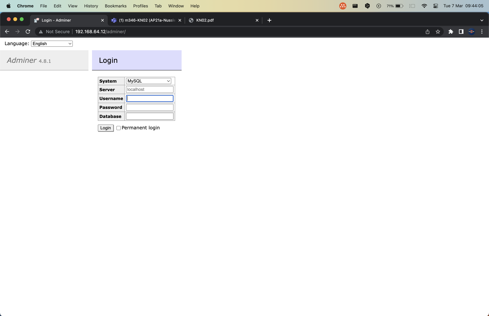
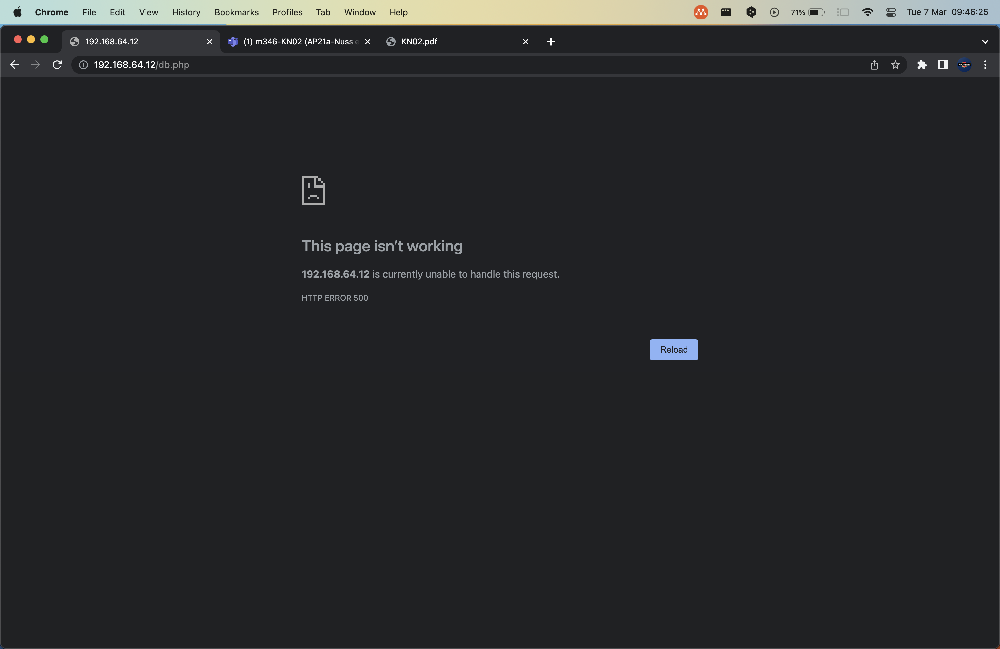

# KN02

## A) Dokumentation

- users: -> Collection von Benutzern
- name: ubuntu ->  Der Benutzername des ersten Benutzers
- sudo: ALL=(ALL) NOPASSWD:ALL -> sudo-Regeln für diesen Benutzer
- groups: users, admin -> Gruppen definieren
- home: /home/ubuntu -> Ort von home besti$mmen
- shell: /bin/bash -> Ort von shell bestimmen
- lock_passwd: false -> Passwort Login erlauben
- plain_text_passwd: 'password' -> Passwort erstellen  
- ssh_pwauth: true -> Ein boolean Wert. Es bestimmt ob eine Passwort-Authentication über SSH aktiviert oder deaktiviert ist
- disable_root: false -> Ein boolean Wert. Es bestimmt ob eine Passwort-Authentication aktiviert oder deaktiviert ist
- packages: -> Collection von Packages

## B) Apache Server aufstellen


## C) Cloud-init

```bash
Info.php
```

```bash
Adminer
```

```bash
db.php
```


Wieso funktioniert es nicht?

Es gibt eine sehr einfache erklärung. Für einen Datenaustausch müsen die Docker im gleichen Netzwerk sein, aber da sie iin zwei verschiedenen VMs sind, werden sie somit isoliert und das bringt dazu, dass sie sich nicht erreichen können.