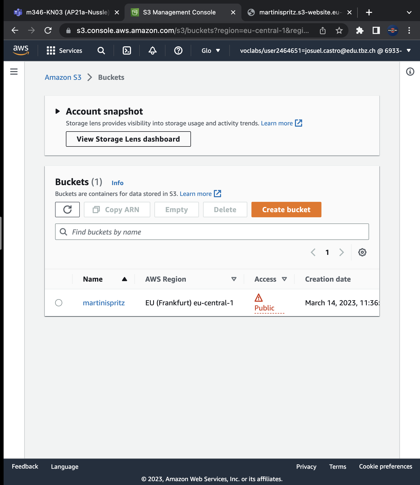

# KN03

## A) Apache Server aufstellen
### a)

```bash
Die hervorgerufene IP der Instanze im Browser
```

```bash
Liste aller kreierten Instanzen im Management Tool
```

```bash
Details einer Instanz; IP kann ausgelesen werden
```

```
Liste aller Security Rules über deine Instanzen
```

## b)


```bash
Liste aller erstellten Buckets
```

```bash
HTML der im Bucket ist, wird im Browser angezeigt
```

```bash
Liste aller Daten im Bucket
```

```bash
Hosting der Daten im Bucket
```

## B)


```bash
ssh_pwauth: true; Man kann sich ohne Problem anmelden
```

```bash
ssh_pwauth: false; Man kann nicht in der Instanz anmelden
```

## C)


```
Zugriffversuch mit dem richtigen Key
```

```
Zugriffversuch mit dem falschen Key
```

## D)


```
KonfigurierterCloudInit
```


```
Login versuche
```


