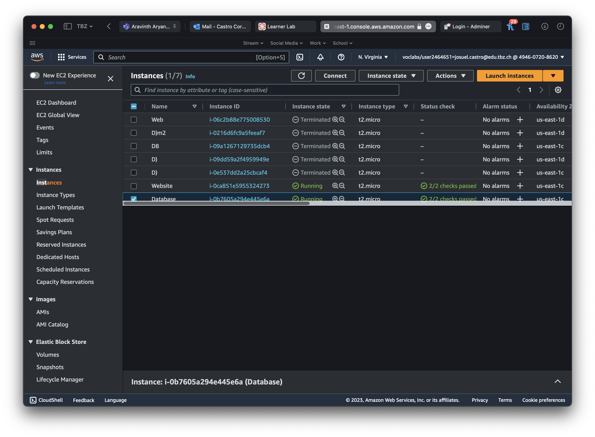
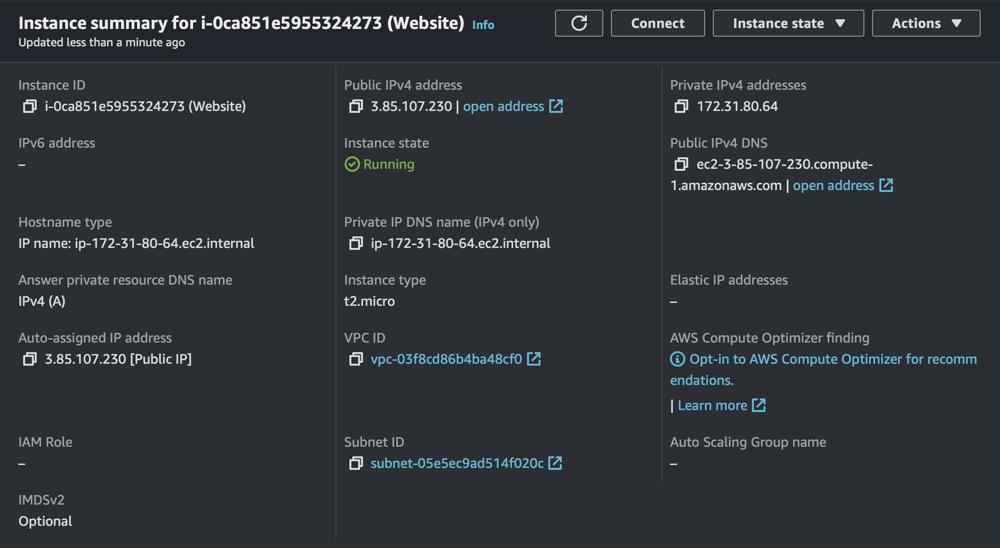
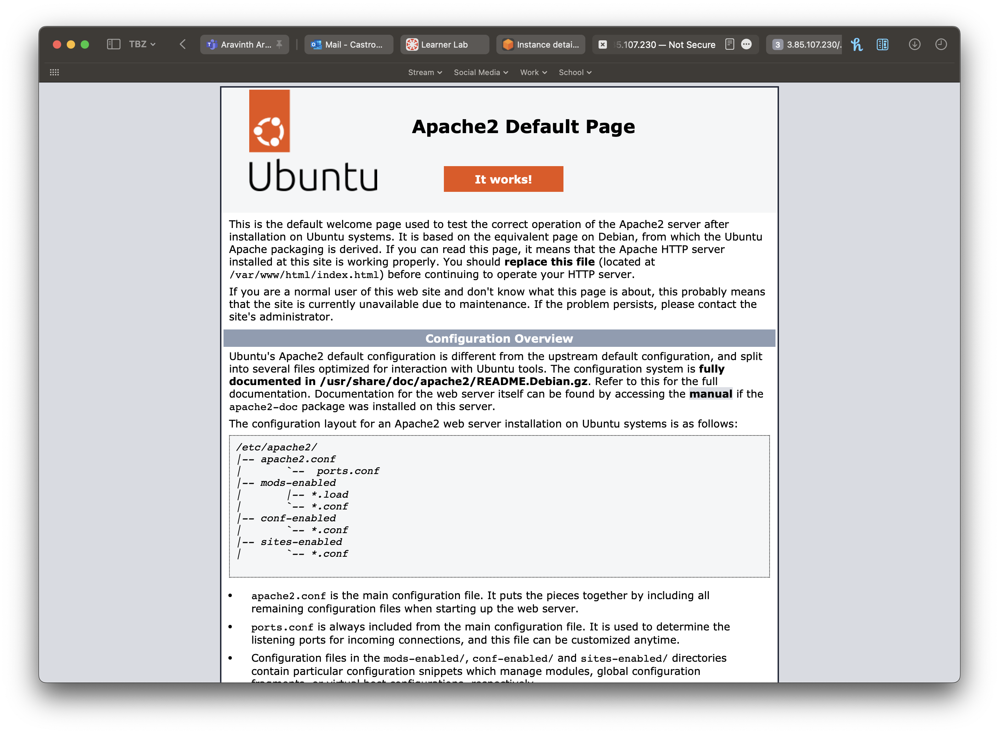
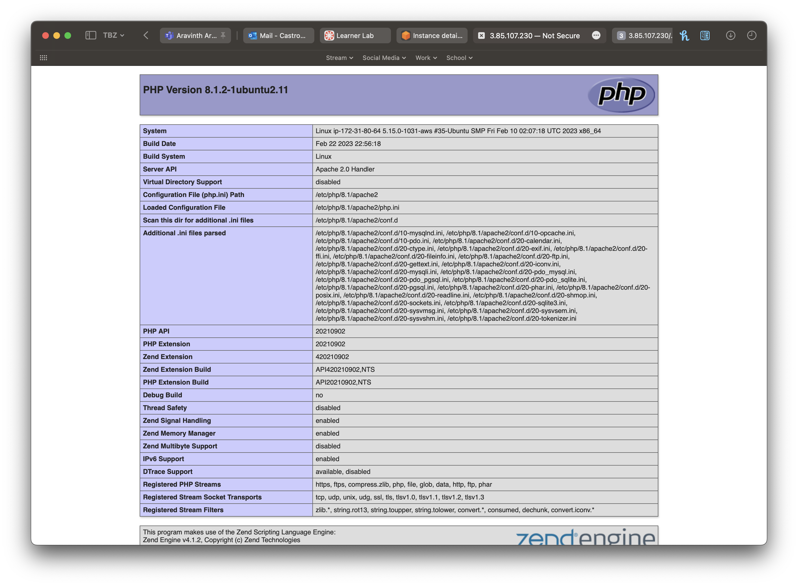
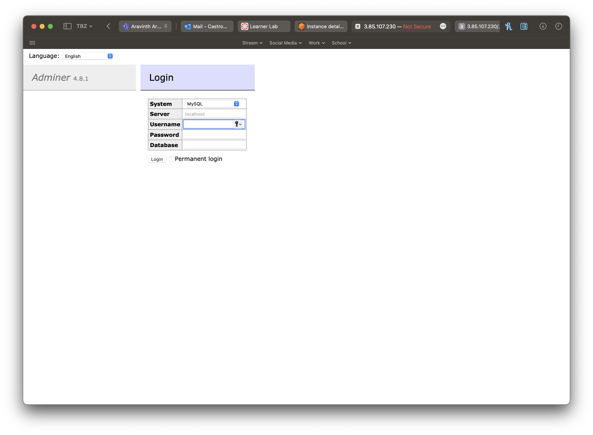
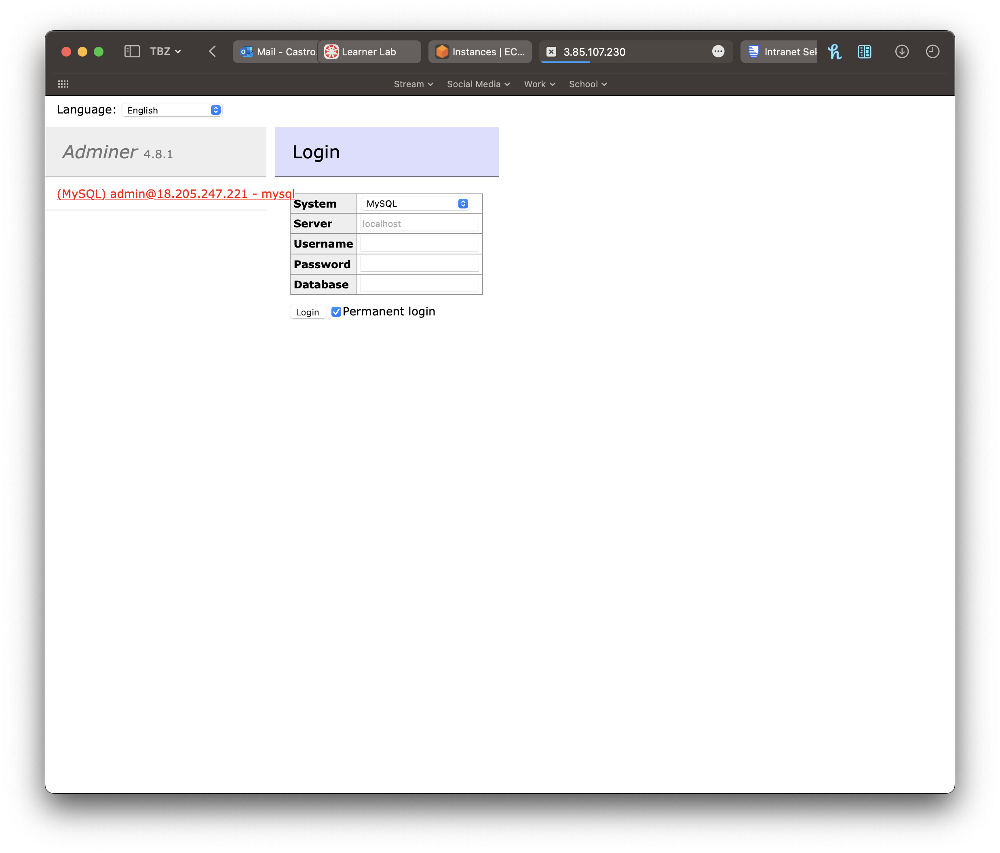

# KN04

# A)  Portierung von Multipass zu AWS

# B) Speicher

## a) Welchem Speichermodell wird S3 zugeordnet?
S3 Amazon gehört zum Objektspeicher-Modell. Das Objektspeicher-Modell ist ein Speichermodell, bei dem Daten als Objekte in einem flachen Raum gespeichert werden. Jedes Objekt hat einen spezifischen Schlüssel, der Dateninhalt und Metadaten enthält. Die Daten können in der Regel über eine REST-API abgerufen und über HTTP-GET-Anforderungen heruntergeladen werden.

## b) 