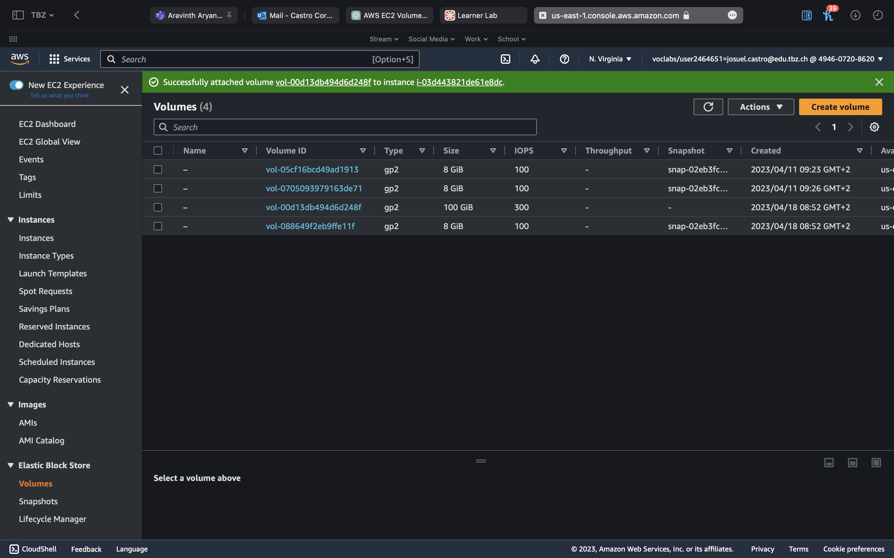
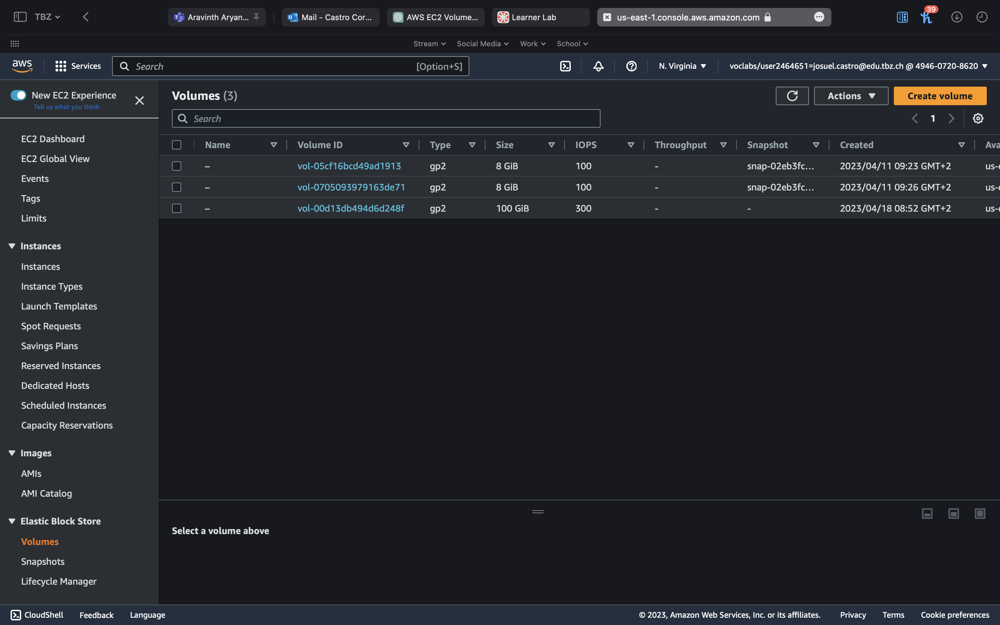

# KN04

# A)  Portierung von Multipass zu AWS

```Die Instanz Konfigurationen befinden sich in einem PDF```


# B) Speicher

## a) Welchem Speichermodell wird S3 zugeordnet?
S3 Amazon gehört zum Objektspeicher-Modell. Das Objektspeicher-Modell ist ein Speichermodell, bei dem Daten als Objekte in einem flachen Raum gespeichert werden. Jedes Objekt hat einen spezifischen Schlüssel, der Dateninhalt und Metadaten enthält. Die Daten können in der Regel über eine REST-API abgerufen und über HTTP-GET-Anforderungen heruntergeladen werden.

## b) 
Wenn Sie eine EC2-Instanz mit EBS-Backed erstellen und die Instanz später löschen, wird standardmäßig auch das Root EBS Volume gelöscht. Alle Daten, die auf lokalen Laufwerken gespeichert sind, gehen ebenfalls verloren. Das bedeutet, dass Sie Ihre wichtigen Daten und Dateien auf einem separaten EBS-Volume oder in einem anderen Speicherort sichern sollten, bevor Sie Ihre Instanz löschen, um Datenverlust zu vermeiden.

Vorher

Nachher

