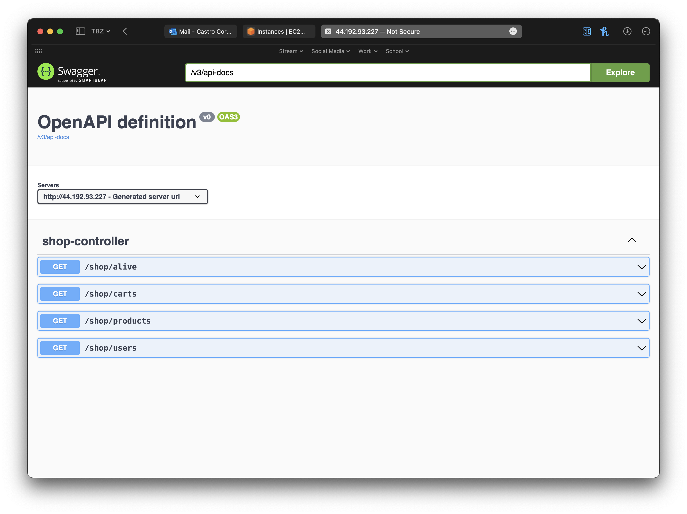
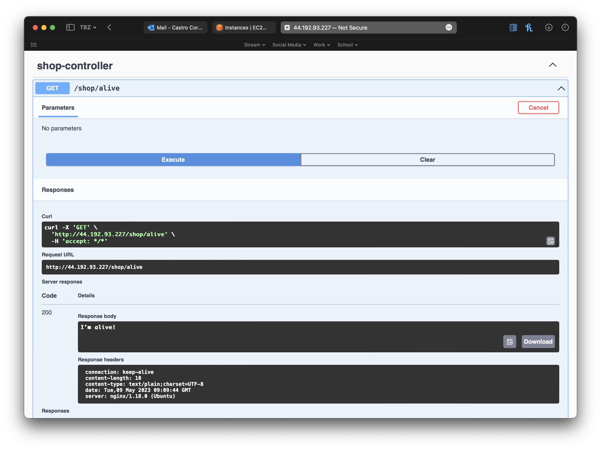
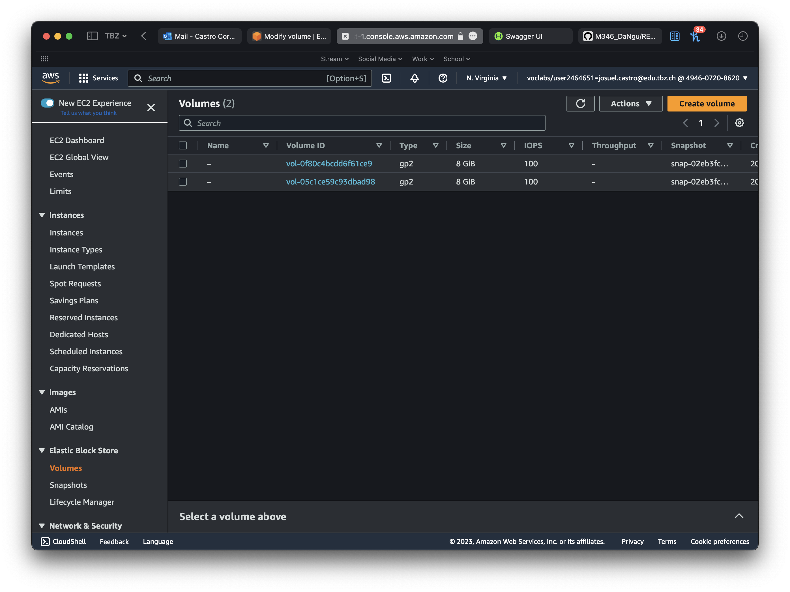
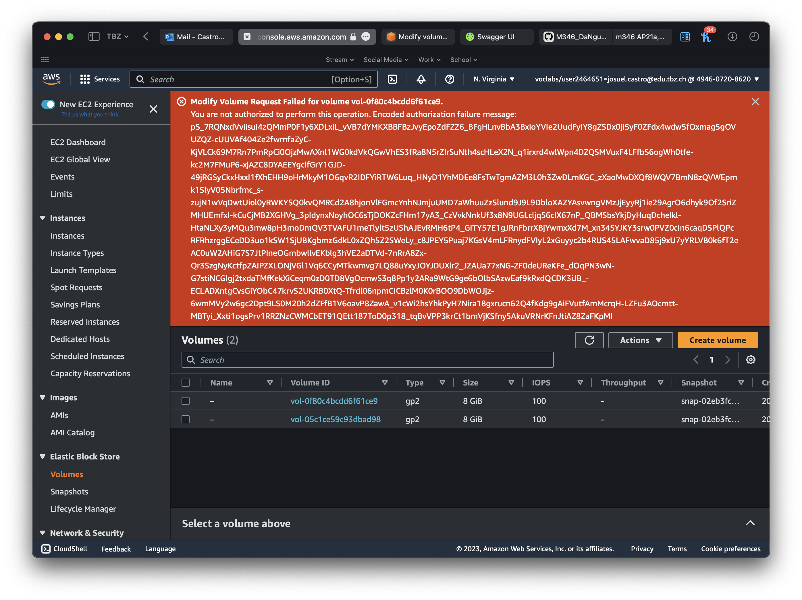
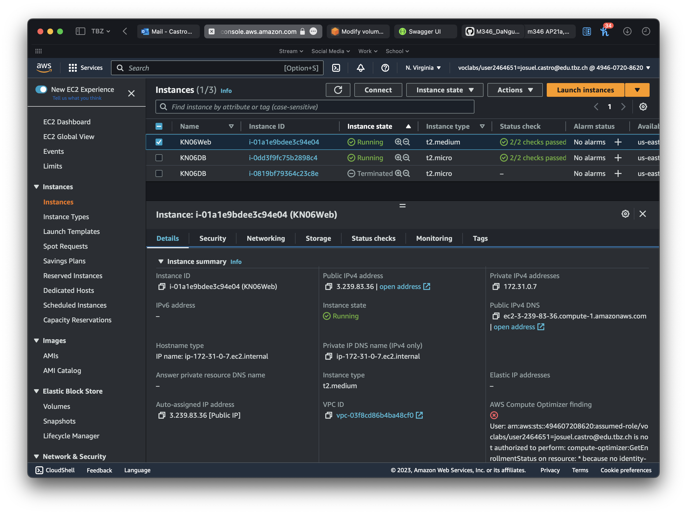

# KN06

# A)  Installation App




# A)  Vertikale Skalierung

Veränderung von Volume für DB:



```Beim verändern des Volumes ist ein Fehler aufgetreten.```



Veränderung von Instanztypen für DB:

Es wurde auf t2.medium gewechselt.

