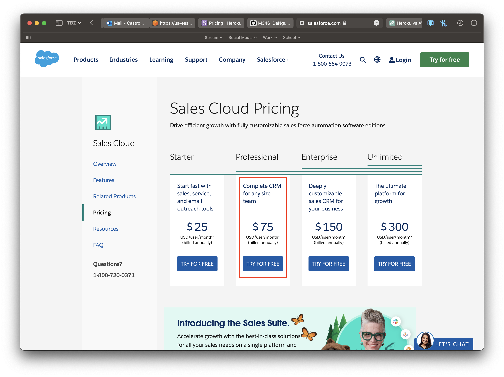

# KN07

# A)  Kostenberechnung AWS

```Die Rechnung ist in einem PDF in diesem Ordner.```

AWS ist ein Cloud-Computing-Service, der von Amazon entwickelt wurde. Es bietet eine breite Palette von Diensten, darunter Rechenleistung, Speicher, Datenbanken, Netzwerke, Analyse, Robotik, maschinelles Lernen und künstliche Intelligenz (KI), Internet der Dinge (IoT), Sicherheit und Anwendungen. Diese Dienste werden von Rechenzentren in 245 Ländern und Regionen auf der ganzen Welt bereitgestellt. AWS bietet eine breite Palette von Diensten, die von kleinen Unternehmen bis hin zu großen Unternehmen genutzt werden können. AWS bietet auch eine breite Palette von Diensten, die von kleinen Unternehmen bis hin zu großen Unternehmen genutzt werden können.

Allgemein beim einstellen fühlte es sich viel flexibler, spezialisierter und personalisierter an.

# B)  Kostenberechnung Heroku

```Die Rechnung ist in einem PDF in diesem Ordner.```

Heroku ist eine Plattform, die von Salesforce als Platform-as-a-Service (PaaS) entwickelt wurde. Entwickler können Anwendungen in verschiedenen Programmiersprachen und Frameworks auf dieser Plattform bereitstellen. Mit Heroku können Anwendungen schnell und einfach erstellt, bereitgestellt und skaliert werden, ohne dass sich Entwickler um die Infrastruktur kümmern müssen.

Obwohl Heroku viele Vorteile bietet, wie die einfache Bereitstellung von Anwendungen und den Zugriff auf viele Datenquellen, gibt es Gründe, warum es sich möglicherweise nicht lohnt, es AWS und Azure vorzuziehen. Heroku kann im Vergleich zu großen Cloud-Anbietern teurer sein, insbesondere bei größeren Anwendungen mit hohem Datenaufkommen. Außerdem ist die Flexibilität bei der Konfiguration von Ressourcen und Services auf Heroku eingeschränkt. Die Verfügbarkeit von Ressourcen und Diensten kann bei Heroku ebenfalls eingeschränkt sein, da es sich um eine auf bestimmte Technologien spezialisierte Plattform handelt.

# C) Kostenberechnung Salesforce



Die Entscheidung zwischen Zoho CRM und Salesforce Sales Cloud hängt von den spezifischen Anforderungen des Unternehmens ab. Beide Anbieter bieten SaaS-Lösungen für CRM-Systeme an, die einfach zu nutzen und schnell einzurichten sind. Die Entscheidung hängt von verschiedenen Faktoren wie Funktionalität, Integration mit anderen Systemen, Preis, Benutzerfreundlichkeit und Kundensupport ab.

Im Vergleich zu IaaS- und PaaS-Lösungen bieten SaaS-Lösungen wie Zoho CRM und Salesforce Sales Cloud den Vorteil, dass sie ohne eigene Infrastruktur schnell und einfach implementiert werden können. Es kann jedoch Einschränkungen bei der Anpassung der Lösung an spezifische Anforderungen des Unternehmens geben.

Bei der Auswahl einer CRM-Lösung sollten auch Aspekte wie Datensicherheit, Datenschutz, Verfügbarkeit und Skalierbarkeit berücksichtigt werden.